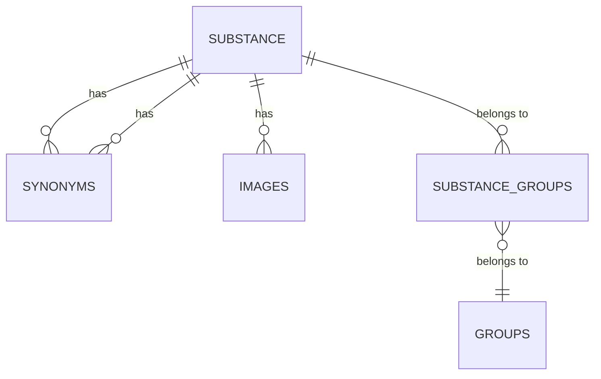

# substanz-datenbank

## projektbeschreibung

Das Ziel meines Projektes ist es Substanzen, sowie Drogen und andere chemikalische Substanzen in einer Datenbank zu erfassen. Um dies dem Benutzer so einfach wie möglich zu machen, wurde ein Webinterface erstellt welches im Backend mit Python und Flask programmiert wurde.

## user stories

**Liste von Substanzen**

Als Benutzer möchte ich eine Liste von Substanzen ansehen können.

**Neue Substanz erstellen**

Als Benutzer möchte ich eine neue Substanz erstellen können, darin zugehörige Gruppierungen erfassen, sowie auch Bilder und Synonyme.

**Substanz editieren**

Als Benutzer möchte ich die Substanzen editieren können.

**Substanz Löschen**

Als Benutzer möchte ich die Substanzen löschen können.

**Substanz suchen**

Als Benutzer möchte ich nach einer Substanz suchen können, anhand deren Name.

## entity relationship diagram

