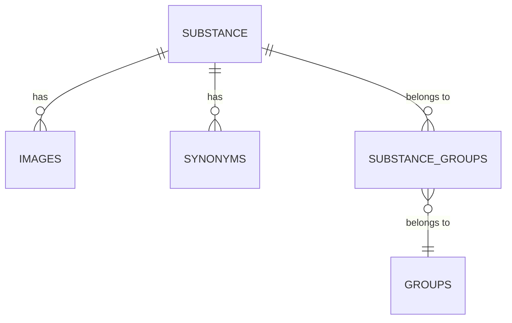

# substanz-datenbank

## `schema`

```mermaid
erDiagram
  SUBSTANCE ||--o{ IMAGES : has
  SUBSTANCE ||--o{ SYNONYMS : has
  SUBSTANCE ||--o{ SUBSTANCE_GROUPS : "belongs to"
  SUBSTANCE_GROUPS }o--|| GROUPS : "belongs to"
```
